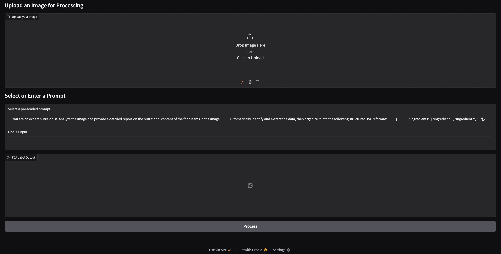
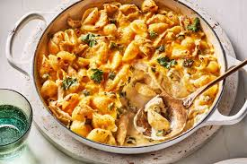
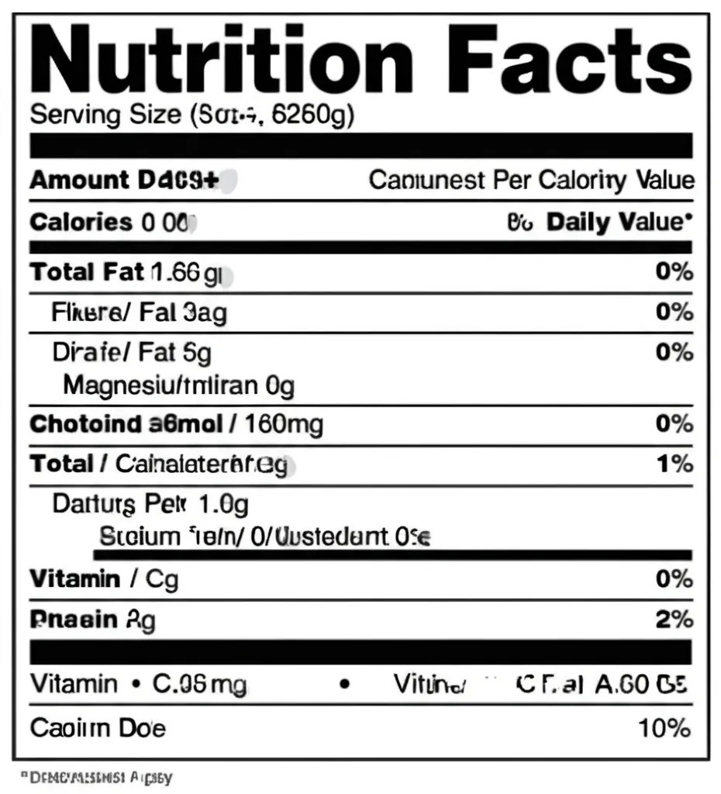

# nutrition-ai-app

## Overview

Nutrition AI App is a cutting-edge application designed to help users analyze their meals and provide nutritional insights using AI technology. This app leverages machine learning to identify food items and calculate their nutritional values, making it easier to maintain a healthy lifestyle.

## Features

- **AI-Powered Food Recognition**: Upload images of your meals, and the app will identify the food items.
- **Nutritional Analysis**: Get detailed nutritional information, including calories, macronutrients, and more.
- **User-Friendly Interface**: Simple and intuitive design for seamless user experience.
- **Customizable Goals**: Set dietary goals and track your progress.

## Installation

1. Clone the repository:
    ```bash
    git clone https://github.com/yourusername/nutrition-ai-app.git
    ```
2. Navigate to the project directory:
    ```bash
    cd nutrition-ai-app
    ```
3. Install dependencies:
    ```bash
    pip3 install -r requirements.txt
    ```
4. Start the development server:
    ```bash
    python3 app.py
    ```

## Usage

1. Open the app in your browser at `http://127.0.0.1:7860`.
2. Upload an image of your meal.
3. View the nutritional breakdown and insights provided by the app.

## Illustration

### UI look


### Example Input


### Sample Return Nutrition Fact
```json
{
    "ingredients": [
        "pasta (shells)",
        "chicken",
        "cheese (likely cheddar, but possibly a blend)",
        "milk or cream",
        "butter or oil",
        "flour (possibly)",
        "onion or garlic (possibly)",
        "green onions or herbs (possibly)",
        "seasoning (salt, pepper, etc.)"
    ],
    "nutritional_values": {
        "calories": "450-600 calories (per serving, depending on portion size and ingredients)",
        "protein": "25-35 grams",
        "carbohydrates": "50-70 grams",
        "fats": "20-30 grams",
        "macro_nutrients": {
            "fiber": "3-5 grams",
            "sugar": "5-10 grams",
            "saturated_fat": "10-15 grams",
            "unsaturated_fat": "5-15 grams"
        },
        "micro_nutrients": {
            "vitamin_a": "100-300 IU",
            "vitamin_c": "10-20 mg",
            "vitamin_d": "50-100 IU",
            "vitamin_e": "2-4 mg",
            "vitamin_k": "10-30 mcg",
            "calcium": "300-500 mg",
            "iron": "2-4 mg",
            "magnesium": "50-100 mg",
            "potassium": "200-400 mg",
            "zinc": "2-4 mg",
            "sodium": "400-800 mg"
        }
    },
    "serving_size": "250-300 grams (estimated)",
    "meal_type": "dinner"
}
```

### Example Output



## License

This project is licensed under the MIT License. See the [LICENSE](./LICENSE) file for details.
